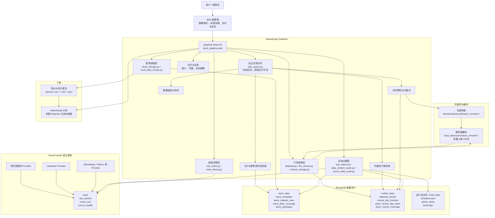
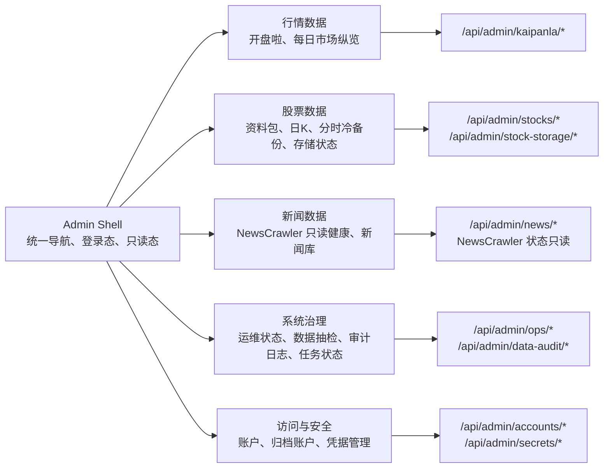
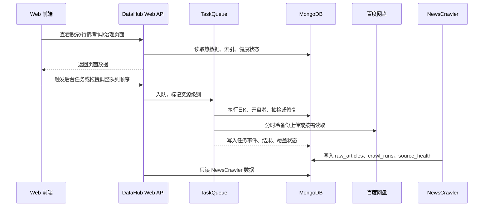
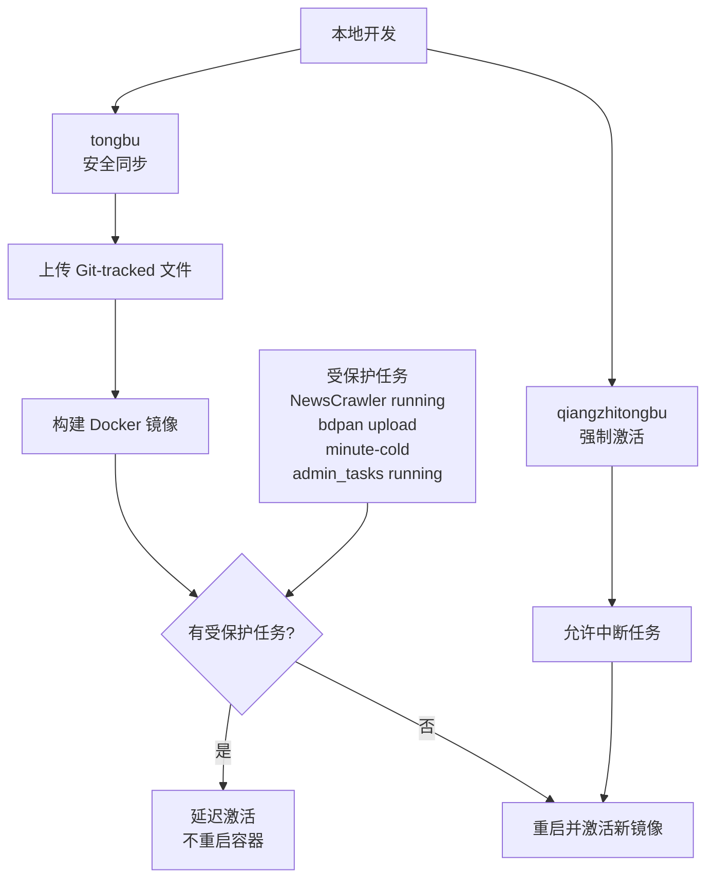

# ValueScope DataHub 架构参考

本文是后续前端和后端开发的架构基线。新增功能、页面、后台任务、数据导出或部署策略时，先对照本文判断应该落在哪一层、读写哪个集合、是否会打断长任务、是否需要进入系统治理页。

> 历史工程名仍为 `NewsAnalysis`，服务器目录、部分包名和百度网盘冷备份 remote root 暂时沿用旧名称。产品定位和文档统一使用 `ValueScope DataHub`。

## 1. 总体架构图

## 2. 前端页面边界

前端静态资源统一放在 `frontend/admin/`。历史目录 `stock_pipeline/web_static/` 已拆出；`stock_pipeline/web.py` 只负责把 `frontend/admin/` 作为静态目录暴露给浏览器。

前端开发约束：

| 页面 | 主职责 | 不应该做的事 |
| --- | --- | --- |
| 行情数据 | 展示开盘啦记录、市场纵览、手动触发开盘啦任务 | 不展示股票资料包健康，也不控制 NewsCrawler |
| 股票数据 | 展示每只股票热数据、日K覆盖、分时冷备份、量价 metadata | 不直接抓新闻，不绕过任务队列执行重 IO |
| 新闻数据 | 只读展示 NewsCrawler 采集结果、来源健康、新闻库 | 不在 DataHub 内启动新闻 Provider |
| 系统治理 | 统一放运维状态、数据抽检、审计日志、后台任务、队列拖拽排序与手动调整、异常解释 | 不放账户归档和密钥明文，不绕过任务队列直接执行重 IO |
| 访问与安全 | 账户、归档账户、系统凭据安全摘要、轮换记录 | 不回显密钥明文，不放业务数据表 |

## 3. 后端数据流

后端边界已经先抽出公共注册表：`backend/auth_policy.py` 管页面权限，`backend/credentials_registry.py` 管凭据规格，`backend/fetch_registry.py` 管统一数据 key 与抓取方法。兼容 Web 入口仍是 `stock_pipeline.web`。

## 4. 数据分层

| 数据 | 当前定位 | 主存储 | 冷备份 | 读取策略 |
| --- | --- | --- | --- | --- |
| 股票资料包 | 热数据 | `stock_data.stock_packages`、`stock_metadata` | 暂不冷备份 | 前端和 ValueScope 分析直接读 |
| 股票日K | 热数据 | `stock_data.stock_dataset_rows`、`stock_daily_coverage` | 暂不冷备份 | 常驻服务器，缺口可检查和补齐 |
| 历史分时 | 冷数据为主 | `market_data.stock_minute_day_index`、近期 `minute_day_buckets` | 百度网盘按股票/年份 JSONL | 先查索引，再从缓存或网盘取目标年份，只解析目标交易日 |
| 开盘啦行情 | 热数据 | `market_data.kaipanla_results` | 暂不冷备份 | 每日定时抓取，前端按交易日和 feature 取最新版本 |
| 新闻原文 | 热数据 | `news.raw_articles` | 暂不冷备份 | NewsCrawler 写入，DataHub 只读展示和供给 |
| 审计与任务 | 运行态数据 | `local_data/*.json`、`reports/*` | 暂不冷备份 | 系统治理页和命令行读取 |

## 5. 任务与部署保护

原则：

1. `tongbu` 只能安全同步和构建；检测到爬虫、冷备份上传或后台任务时必须延迟激活。
2. `qiangzhitongbu` 才允许强制重启，适合确认可以中断任务时使用。
3. 长任务应进入 `TaskQueue` 或独立 worker，不能在 Web 请求线程里直接做重 IO。
4. 部署脚本只同步 Git 已跟踪文件；新增模块、脚本、测试必须先 `git add`。

## 6. 新功能落点参考

| 需求类型 | 后端落点 | 前端落点 | 测试要求 |
| --- | --- | --- | --- |
| 新股票数据字段或导出 | `stock_pipeline/*` 独立模块 + `scripts/*` 包装脚本 | 股票数据页或系统治理页下载入口 | 单元测试 + CLI/help 测试 + 小样本导出测试 |
| 日K/分时覆盖检查 | `stock_storage.py`、`stock_storage_repair.py`、`daily_k_coverage.py` | 股票数据 / 股票存储状态 subpage | 覆盖计算测试 + 修复路径测试 |
| 开盘啦功能 | `kaipanla.py`、`KaipanlaScheduler` | 行情数据页 | 功能映射测试 + 每日纵览回归 |
| 新闻采集 | `NewsCrawler/` Provider | 新闻数据页只读状态 | NewsCrawler provider 测试，不在 DataHub 新增采集逻辑 |
| 系统健康与运维 | `ops_status.py`、`data_random_audit.py`、`server_data_audit.py` | 系统治理页 | API smoke + 前端静态测试 |
| 凭据、账户、安全 | `web.py` 用户和 secret store | 访问与安全页 | 安全测试，确认不回显密钥 |

## 7. 当前开发参考约定

- DataHub 主职责是数据采集、治理、展示和供给，不再把下游分析引擎塞回主项目。
- 项目按三层维护：`frontend/admin/` 放前端，后端 API/任务边界参考 `backend/README.md`，数据中台边界参考 `datahub/README.md` 和 `docs/LAYER_BOUNDARIES.md`。
- NewsCrawler 拥有新闻采集，DataHub 只读新闻库。
- Tushare 当前归档，不作为新功能默认依赖。
- 分时冷备份按索引可取回，服务器只保留索引、近期缓存和必要热数据。
- 量价 metadata 导出使用 `scripts/export_stock_volume_price_metadata.py`，它只读 Mongo，默认只对热缓存分时做成交量抽检。
- 前端新增页面时优先复用现有 Admin Shell、表格、分页、状态徽标、任务状态和系统治理信息架构。
