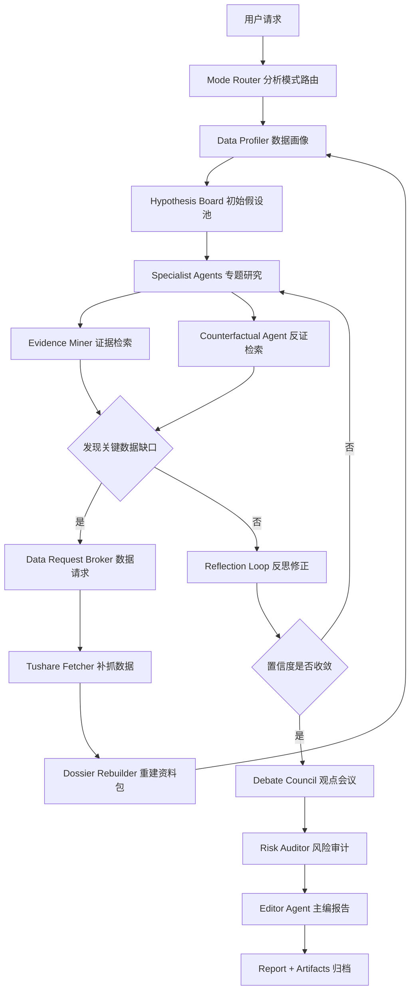
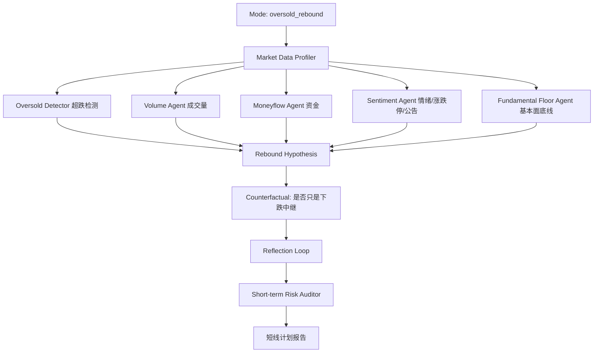
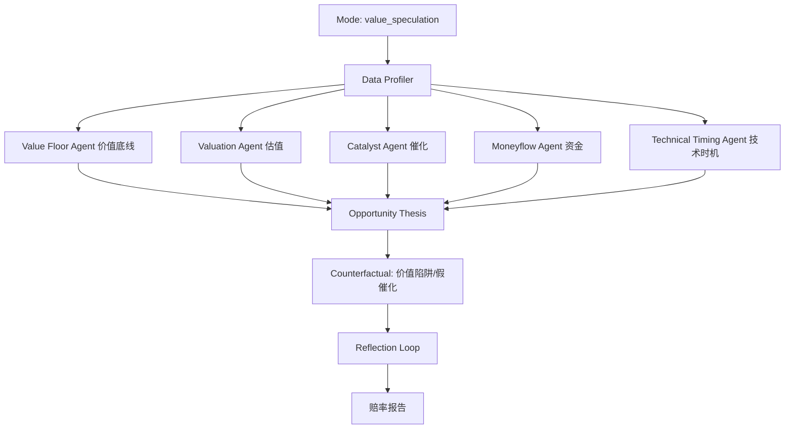
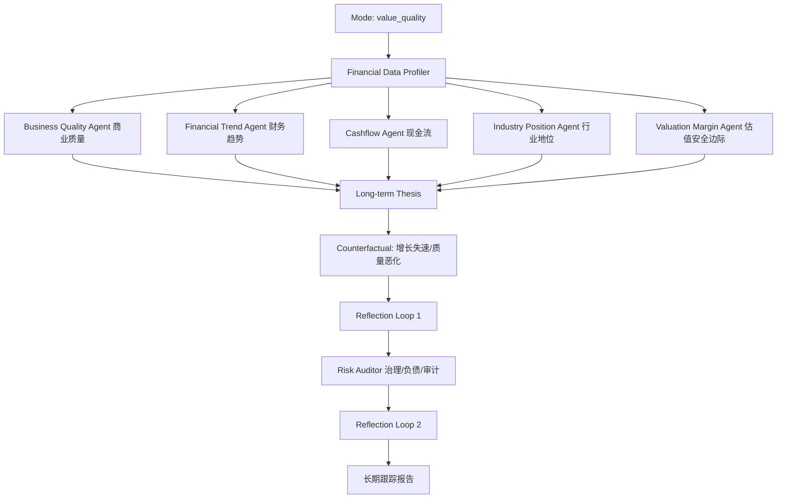
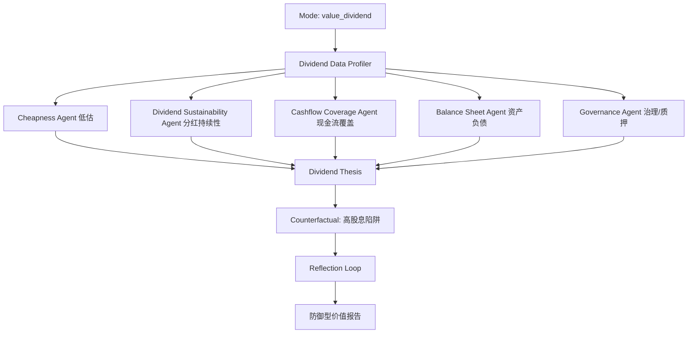

# 多层 Agent 股票分析架构设计

本文档用于后续开发“多 agent 股票分析系统”。新版架构不再采用简单线性流水线，而是采用“分析模式路由 + 多轮假设检验 + 反证审计 + 观点收敛”的结构。不同分析类型会使用不同 agent 组合、数据权重、迭代次数和报告结构。

说明：系统不保存模型原始私有思维链，而是保存可审计的结构化推理摘要，包括初始假设、证据、反证、修正理由、置信度变化和最终结论。这比直接展示原始 CoT 更适合工程落地、复盘和风控。

## 1. 总体目标

多 agent 系统要完成的不只是“多写几份报告”，而是模拟一套投研团队的工作方式：

1. 根据分析类型选择不同研究路径，而不是所有股票都跑同一套流程。
2. 每个研究观点必须经过证据检索、反证检索和风险审计。
3. 允许 agent 之间互相质询、推翻、修正观点。
4. 最终报告给出结论，也展示“为什么不是另一个结论”的关键理由。
5. 分析过程中如果发现关键数据缺口，系统可以提出数据请求，自动尝试通过 Tushare 补抓数据、重建资料包，并继续分析。
6. 所有中间产物本地归档，支持历史读取、版本对比和后续继续开发。

## 2. 核心思想：非线性反思回路

每次多 agent 分析不是一次性生成，而是至少包含三轮：

1. 初判轮：各专题 agent 根据自己的领域生成初始判断和置信度。
2. 反证轮：Critic/Risk/Counterfactual agent 主动寻找反例、数据缺口和逻辑漏洞。
3. 收敛轮：专题 agent 根据反证修正观点，Editor agent 汇总共识、分歧和最终报告。



## 3. 分析模式路由

`Mode Router` 根据 `analysis_type` 决定运行哪些 agent、读取哪些数据、最多迭代几轮、最终报告偏向什么结构。

| 分析类型 | 时间尺度 | 主要目标 | 数据权重 | 必跑 agent |
| --- | --- | --- | --- | --- |
| `oversold_rebound` 超跌反弹 | 1-20 个交易日 | 判断是否存在短线修复窗口 | 日线、成交量、资金流、行业情绪、公告催化 | Technical、Volume、Moneyflow、Sentiment、Risk |
| `value_speculation` 价值投机 | 1-6 个月 | 在价值底线上找交易赔率和催化 | 估值、基本面底线、资金、技术、公告 | Value Floor、Catalyst、Moneyflow、Technical、Risk |
| `value_quality` 质量成长价值 | 1-3 年 | 判断公司是否值得长期跟踪 | 财报、ROE、现金流、主营、行业地位、估值 | Financial Quality、Business Model、Industry、Valuation、Risk |
| `value_dividend` 低估红利价值 | 6 个月-3 年 | 判断低估和分红是否可持续 | 分红、现金流、负债、估值、治理 | Dividend、Cashflow、Balance Sheet、Valuation Trap、Risk |

## 4. 数据分层与权重

### 短线/超跌反弹数据权重

高权重：
- `daily`：开高低收、涨跌幅、成交额、成交量。
- `daily_basic`：换手率、量比、总市值、流通市值。
- `moneyflow`：大单/超大单流入流出、近 5/20 日资金净额。
- `margin_detail`：融资融券余额变化。
- `stk_limit`：涨跌停价格，辅助判断情绪和连板空间。
- `sw_daily`：行业指数走势和行业 beta。
- 近 30-60 条公告标题：回购、增持、业绩预告、中标、重组等催化。

低权重但不可忽略：
- 最近一期财报质量，用于判断是否存在基本面底线。
- 估值，用于判断反弹空间是否被高估值压制。

### 中线价值投机数据权重

高权重：
- 估值：PE/PB/PS/股息率和相对位置。
- 财务趋势：营收、净利润、ROE、现金流。
- 资金：近 5/20 日资金流和融资余额。
- 技术：MA20/MA60/MA120/MA250。
- 催化：业绩预告、回购、分红、重大合同、行业趋势。

### 长线质量成长数据权重

高权重：
- `income`、`balancesheet`、`cashflow`、`fina_indicator`。
- ROE、毛利率、净利率、营收/利润增速、经营现金流/利润。
- 主营业务构成和业务集中度。
- 行业地位和行业周期。
- 治理风险：质押、股东变化、审计意见。

低权重：
- 短期日线波动只用于判断买入时点，不用于公司质量判断。

### 低估红利数据权重

高权重：
- 股息率、现金分红记录、分红进度。
- 经营现金流覆盖利润。
- 资产负债率、流动比率、货币资金、应收、存货。
- PE/PB 是否低估，以及低估是否由业绩恶化造成。
- 审计意见、质押、回购、股东结构。

低权重：
- 短线技术面只用于判断等待价格，不决定红利价值。

## 5. Agent 角色设计

### Mode Router Agent

职责：
- 解析 `analysis_type`。
- 选择运行图谱、agent 权重、迭代次数和报告模板。
- 生成 `run_plan.json`。

输出字段：
- `mode`
- `time_horizon`
- `agents`
- `data_priorities`
- `max_iterations`
- `acceptance_rules`

### Data Profiler Agent

职责：
- 读取 `full_data.json`、`dossier.json`、各分析资料包。
- 生成数据画像：数据范围、最新交易日、财报新旧、接口缺失、关键字段缺失。
- 根据模式过滤数据，例如超跌只保留近 250 日行情和近 60 日资金，长线价值保留最近 8-12 期财报。

输出：
- `data_profile.json`
- `mode_specific_context.json`
- `data_gaps.json`

### Hypothesis Generator Agent

职责：
- 根据模式生成 3-5 个初始假设，而不是直接写结论。

示例：
- 超跌反弹：`H1: 已经超跌但未确认反弹`、`H2: 行业共振形成修复`、`H3: 下跌来自基本面恶化不宜接近`。
- 长线价值：`H1: 公司具备长期复利质量`、`H2: 公司质量一般但估值便宜`、`H3: 低估源于价值陷阱`。

输出：
- `hypotheses`
- `initial_confidence`
- `required_evidence`
- `disconfirming_evidence`

### Evidence Miner Agent

职责：
- 针对每个假设检索支持证据。
- 必须给出数据路径，避免空泛判断。
- 如果现有资料包不足以验证假设，必须输出结构化 `data_requests`，而不是直接猜测。

输出：
- `supporting_evidence`
- `evidence_strength`
- `missing_fields`
- `data_requests`

### Counterfactual Agent

职责：
- 主动寻找能推翻假设的证据。
- 用“如果我是反方，我会怎么质疑”来发现漏洞。
- 如果反证依赖缺失数据，必须向 Data Request Broker 提交补数请求。

输出：
- `counter_evidence`
- `logic_gaps`
- `alternative_explanations`
- `data_requests`

### Data Request Broker Agent

职责：
- 接收各 agent 提出的数据请求。
- 判断请求是否必要、是否重复、是否已在本地数据中存在。
- 将自然语言需求映射到 Tushare 接口和字段。
- 根据分析模式决定补抓优先级，例如超跌反弹优先补 `daily`、`daily_basic`、`moneyflow`，长线价值优先补财报和分红。

输出：
- `approved_requests`
- `rejected_requests`
- `request_deduplication`
- `tushare_jobs`

请求示例：

```json
{
  "request_id": "req_001",
  "requested_by": "moneyflow_agent",
  "mode": "oversold_rebound",
  "need": "验证近 5 日和近 20 日资金是否回流",
  "dataset": "moneyflow",
  "fields": ["trade_date", "net_mf_amount", "buy_lg_amount", "sell_lg_amount"],
  "date_range": {"lookback_days": 60},
  "priority": "high",
  "blocking": true
}
```

### Tushare Fetcher Agent

职责：
- 执行 Data Request Broker 批准的数据请求。
- 调用 `TushareClient` 或 `StockDataCollector` 中的接口。
- 处理接口权限不足、频率限制、空返回和字段缺失。
- 将补抓结果写入本地 `raw` 或增量数据文件。

输出：
- `fetch_results`
- `fetch_errors`
- `rate_limit_notes`
- `permission_gaps`

### Dossier Rebuilder Agent

职责：
- 在补抓数据后重建 `full_data.json`、`dossier.json` 和模式资料包。
- 标记哪些数据来自本轮动态补抓。
- 触发相关 agent 重新执行，不要求所有 agent 从头重跑。

输出：
- `rebuilt_files`
- `changed_datasets`
- `affected_agents`
- `resume_plan`

### Reflection Agent

职责：
- 读取初始假设、支持证据和反证。
- 修正评分、评级和置信度。
- 输出简短的结构化推理摘要，不输出原始隐藏思维链。

输出：
- `reasoning_summary`
- `confidence_before`
- `confidence_after`
- `revised_rating`
- `what_changed`

### Debate Council Agent

职责：
- 把多个专题 agent 放进同一张观点表。
- 找出冲突，例如：
  - 技术修复强，但资金仍净流出。
  - 估值便宜，但利润和现金流恶化。
  - 分红高，但负债和质押压力上升。
  - 行业走强，但公司基本面落后行业。

输出：
- `agreements`
- `conflicts`
- `unresolved_questions`
- `confidence_adjustments`

### Risk Auditor Agent

职责：
- 独立审计最终结论。
- 风险 agent 不参与“找机会”，只负责拆台。

风险类别：
- 数据缺口风险
- 财务恶化风险
- 估值陷阱风险
- 治理/质押风险
- 流动性风险
- 技术破位风险
- 短线情绪退潮风险

### Editor Agent

职责：
- 将收敛后的观点写成报告。
- 报告必须包括“结论、证据、反证、分歧、观察条件、证伪条件”。

## 6. 不同分析类型的执行图谱

### 6.1 超跌反弹

目标：判断是否存在短线修复窗口。它不是长线价值判断，核心是“跌够了吗、止跌了吗、有没有资金和情绪确认、失败怎么办”。



重点 agent：
- Oversold Detector：计算 20/60/120 日跌幅、最大回撤、均线偏离。
- Volume Agent：判断缩量下跌、放量止跌、放量反弹、异常换手。
- Moneyflow Agent：判断近 5/20 日资金是否回流。
- Sentiment Agent：关注行业指数、涨跌停、公告催化和市场情绪。
- Fundamental Floor Agent：只判断是否有明显基本面雷，不做长线详细估值。

迭代规则：
- 如果“超跌程度高”但“资金未回流”，结论不得高于 `反弹观察`。
- 如果“技术修复 + 资金回流”但“基本面明显恶化”，必须降级并强调风险。
- 如果“跌幅不够 + 无催化”，直接进入 `弱势等待/回避`，不继续深度迭代。

报告结构：
1. 总结论：反弹观察 / 试错窗口 / 弱势等待 / 回避
2. 超跌证据
3. 止跌与修复证据
4. 资金和情绪确认
5. 是否存在基本面底线
6. 反证：为什么可能只是下跌中继
7. 短线计划：观察、试错、失效、风控

### 6.2 价值投机

目标：在基本面有底线的前提下，判断是否存在中线赔率窗口。



迭代规则：
- 没有价值底线时，技术和资金不能把结论推到 `小仓试错`。
- 有价值底线但没有催化，只能是 `观察/等待`。
- 有催化但估值和业绩不支撑，需要标记为纯题材风险。

### 6.3 质量成长价值

目标：判断公司是否值得长期跟踪，而不是判断明天涨跌。



重点 agent：
- Business Quality Agent：主营业务、行业位置、收入来源。
- Financial Trend Agent：营收、利润、ROE、毛利率、净利率趋势。
- Cashflow Agent：利润含金量、自由现金流线索。
- Industry Position Agent：行业景气与公司相对位置。
- Valuation Margin Agent：估值是否给长期跟踪留安全边际。

迭代规则：
- 财务质量差时，估值低不能直接判定为机会。
- 行业好但公司财务落后，要降低置信度。
- 日线趋势只作为“跟踪/等待价格”的辅助，不参与公司质量评分。

报告结构：
1. 总结论：优质可跟踪 / 估值等待 / 质量存疑 / 回避
2. 公司质量证据
3. 财务趋势
4. 现金流和资产负债
5. 行业地位
6. 估值安全边际
7. 反证和证伪条件
8. 长期跟踪指标

### 6.4 低估红利价值

目标：判断低估和分红是否可持续，重点区分“便宜”和“价值陷阱”。



迭代规则：
- 股息率高但现金流覆盖不足，必须进入 `分红不稳` 或 `回避`。
- PB/PE 低但利润持续下滑，必须标记为价值陷阱风险。
- 治理和质押风险高时，红利评级要降级。

## 7. 反思回路设计

每个核心专题 agent 都走以下结构：

```text
Round 0: 数据画像
Round 1: 初始假设和初始评分
Round 2: 支持证据检索
Round 3: 反证和替代解释
Round 4: 修正观点和置信度
Round 5: 与其他 agent 辩论
Round 6: 最终收敛
```

每一轮保存为 JSON：

```json
{
  "round": 3,
  "agent": "oversold_detector",
  "hypothesis": "该股票存在超跌反弹观察窗口",
  "supporting_evidence": [
    {
      "claim": "近 20 日跌幅较大",
      "data_path": "market.technical_snapshot.return_pct.20d",
      "value": -12.4,
      "strength": "medium"
    }
  ],
  "counter_evidence": [
    {
      "claim": "近 5 日资金仍净流出",
      "data_path": "market.moneyflow_recent",
      "strength": "high"
    }
  ],
  "reasoning_summary": "超跌条件成立，但资金尚未确认，因此从试错窗口下调为反弹观察。",
  "confidence_before": 0.68,
  "confidence_after": 0.54,
  "revision": "downgrade"
}
```

## 8. 动态数据请求闭环

动态补数据是多 agent 系统的重要能力：当 agent 发现现有资料包不足以验证关键假设时，它不能靠猜测补齐结论，而要提交结构化数据请求。

### 8.1 执行流程

```text
Agent 发现缺口
  -> 输出 data_requests
  -> Data Request Broker 去重、审批、映射接口
  -> Tushare Fetcher 补抓数据
  -> Dossier Rebuilder 重建资料包
  -> Orchestrator 只重跑受影响 agent
  -> Reflection Agent 修正结论和置信度
```

### 8.2 需求到 Tushare 接口映射

| 分析需求 | 优先接口 | 典型使用场景 |
| --- | --- | --- |
| 日线走势、涨跌幅、K 线 | `daily`、`weekly`、`monthly` | 超跌、趋势、技术修复 |
| 成交量、换手率、量比、市值 | `daily_basic` | 短线情绪、流动性、估值 |
| 资金流入流出 | `moneyflow` | 超跌反弹、价值投机资金确认 |
| 融资融券变化 | `margin_detail` | 杠杆资金、风险偏好 |
| 涨跌停价格 | `stk_limit` | 情绪、连板空间、短线风险 |
| 财务质量 | `income`、`balancesheet`、`cashflow`、`fina_indicator` | 长线价值、基本面底线 |
| 分红与股东回报 | `dividend`、`repurchase` | 低估红利、价值底线 |
| 主营业务 | `fina_mainbz` | 质量成长、业务结构 |
| 股东变化和质押 | `top10_holders`、`stk_holdernumber`、`pledge_stat` | 治理风险、筹码结构 |
| 公告和事件 | `anns_d`、`forecast`、`express` | 催化、风险事件、业绩验证 |
| 行业走势 | `index_member_all`、`sw_daily` | 行业 beta、行业共振 |

### 8.3 不同模式的补数优先级

超跌反弹：
- 第一优先级：`daily`、`daily_basic`、`moneyflow`、`stk_limit`。
- 第二优先级：`sw_daily`、`anns_d`、`margin_detail`。
- 只有当基本面底线不清楚时，才补财报数据。

价值投机：
- 第一优先级：估值、资金、催化、技术。
- 第二优先级：财报趋势和股东结构。
- 如果价值底线缺失，应先补财报再讨论交易窗口。

质量成长价值：
- 第一优先级：财报、现金流、主营、行业。
- 第二优先级：治理、审计、估值。
- 技术和短线资金一般不触发阻塞式补数。

低估红利价值：
- 第一优先级：分红、现金流、负债、估值。
- 第二优先级：审计、质押、回购、股东结构。
- 如果分红记录或现金流缺失，必须阻塞最终积极结论。

### 8.4 补数边界

动态补数不能无限循环，需要有硬规则：

- 单次 agent run 最多补数 2 轮。
- 同一接口失败后本轮不重复请求。
- Tushare 权限不足或频率限制时，记录 `permission_gaps`，并降低置信度。
- 非关键数据缺口不阻塞报告，只进入“需要继续跟踪”。
- 补抓到的数据必须写入本地并归档，不允许只存在内存中。

## 9. 置信度与收敛规则

系统不能只输出评分，还要输出置信度。置信度不是预测准确率，而是“当前数据支持该结论的充分程度”。

建议规则：
- `0.80-1.00`：证据充分，反证较弱。
- `0.60-0.79`：证据较充分，但存在需要跟踪的反证。
- `0.40-0.59`：证据分裂，只能观察。
- `0.00-0.39`：证据不足或反证强，不应形成积极结论。

收敛条件：
- 连续两轮 `rating_hint` 不再变化。
- 置信度变化小于 `0.08`。
- Risk Auditor 未发现新的高等级风险。
- Debate Council 没有未解决的核心冲突。

如果不收敛：
- 最终报告必须写成“分歧报告”，不能强行给单一确定判断。

## 10. 产物目录

```text
local_data/{ts_code}/current/agent_runs/{run_id}/
  run_manifest.json
  data_profile.json
  mode_context.json
  data_requests.json
  tushare_fetch_results.json
  hypotheses.json
  rounds/
    01_initial/
    02_evidence/
    03_counterfactual/
    04_reflection/
    05_debate/
  agents/
    oversold_detector.json
    volume_agent.json
    moneyflow_agent.json
    financial_quality_agent.json
    dividend_agent.json
    risk_auditor.json
  debate_council.json
  confidence_trace.json
  final_report.md
```

## 11. 统一输出契约

每个 agent 必须输出结构化 JSON：

```json
{
  "agent": "moneyflow_agent",
  "mode": "oversold_rebound",
  "rating_hint": "资金未确认",
  "confidence": 0.57,
  "scores": {
    "capital_return": 2,
    "risk_pressure": 3
  },
  "key_findings": [
    {
      "claim": "近 5 日资金净流出",
      "data_path": "capital_flow.derived.five_day_net_mf_amount",
      "strength": "high"
    }
  ],
  "counter_evidence": [
    {
      "claim": "近 20 日资金净流入，说明并非完全无资金关注",
      "data_path": "capital_flow.derived.twenty_day_net_mf_amount",
      "strength": "medium"
    }
  ],
  "reasoning_summary": "短线资金尚未确认，不能把超跌直接升级为试错窗口。",
  "watchlist": ["5 日资金净额", "20 日资金净额", "换手率", "MA20"],
  "invalidating_signals": ["继续放量下跌", "资金连续净流出", "跌破前低"]
}
```

## 12. 开发阶段

### 第一阶段：模式路由 + 结构化产物

目标：
- 新增 `stock_pipeline/agents/`。
- 实现 `ModeRouter`、`DataProfiler`、`AgentResult`。
- 先不并行，保证产物结构稳定。

### 第二阶段：四种模式的不同运行图谱

目标：
- `oversold_rebound` 跑短线图谱。
- `value_quality` 跑长线质量图谱。
- `value_dividend` 跑红利图谱。
- `value_speculation` 跑价值投机图谱。

### 第三阶段：反证与反思回路

目标：
- 实现 `CounterfactualAgent` 和 `ReflectionAgent`。
- 每个模式至少保留两轮修正记录。

### 第四阶段：动态数据请求闭环

目标：
- 实现 `DataRequestBroker`、`TushareFetcher`、`DossierRebuilder`。
- agent 可以在分析中提出补数请求。
- 补数后只重跑受影响 agent，并保存补数记录。

### 第五阶段：观点会议和置信度收敛

目标：
- 实现 `DebateCouncil`。
- 保存 `confidence_trace.json`。
- 最终报告展示共识、分歧和未解决问题。

### 第六阶段：前端历史和对比

目标：
- 前端可查看每次 agent run。
- 可对比两次运行的结论变化、评分变化、风险变化。

## 13. 与当前系统的关系

当前已经完成：
- 单框架分析类型注册。
- 四种分析资料包。
- 单框架报告生成和读取。
- 历史分析结果读取接口。

后续多 agent 系统应在此基础上新增，而不是替代：
- 单框架报告仍保存为 `{analysis_type}.md`。
- 多 agent 报告保存为 `multi_agent_{analysis_type}.md`。
- 多轮反思产物保存到 `agent_runs/{run_id}/`。

这样可以保留当前可用功能，同时逐步把系统升级成真正的投研式多 agent 架构。
