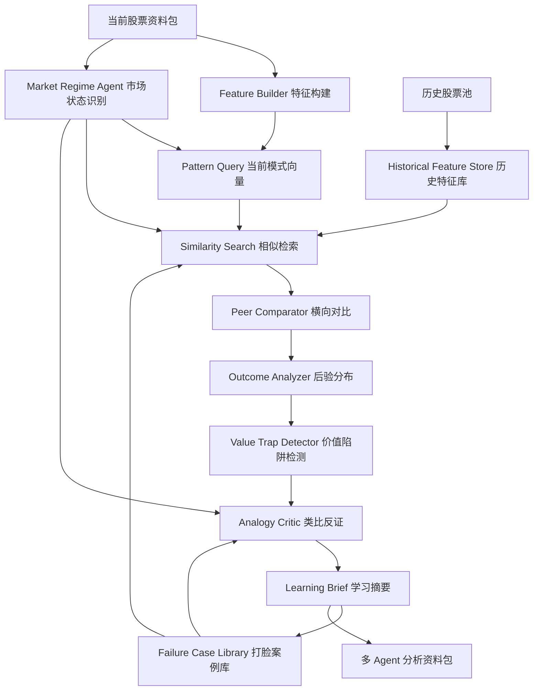
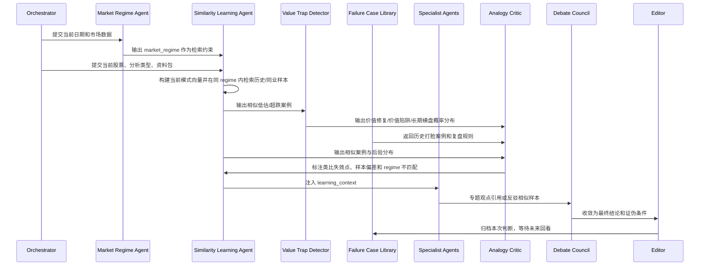

# 历史相似走势与横向学习模块规划

本文档规划一个新的“历史相似走势 / 横向学习”能力。目标不是预测未来，而是让多 Agent 分析在给出结论前，先识别当前市场状态，再检索历史中相似的价格、成交、资金、基本面和行业环境，回答三个问题：

1. 这只股票过去有没有出现过类似结构，后来通常怎么走？
2. 同行业、同市值、同风格股票出现类似结构时，后续表现有什么分布？
3. 当前案例和历史相似案例的关键差异是什么，哪些差异会让类比失效？
4. 当前低估或超跌在“价值修复、价值陷阱、长期横盘”三种结局中的概率分布是什么？
5. 如果系统未来被打脸，应该如何把这次错误沉淀成下一次判断的约束？

说明：模块只输出研究证据和情景分布，不输出确定性预测。所有相似案例必须带市场状态、数据路径、样本窗口、相似度分解和结局分类，避免“看起来像”的主观类比。最终输出必须优先展示概率分布，而不是把复杂不确定性压成单一标签。

## 1. 设计原则

### 1.1 相似不是同一

“已有的事后必再有”可以作为研究假设，但系统必须把相似拆成可检验的结构：

- 价格结构相似：跌幅、回撤、均线位置、波动率、缺口、涨停/跌停。
- 成交结构相似：换手、量比、成交额放缩、下跌放量或缩量。
- 资金结构相似：近 5/20/60 日净流入、大小单结构、融资余额变化。
- 基本面状态相似：盈利拐点、ROE、毛利率、现金流、负债压力、业绩预告。
- 估值位置相似：PE/PB/股息率、市值、历史分位。
- 行业环境相似：申万行业走势、行业指数强弱、同板块扩散情况。
- 事件催化相似：回购、分红、业绩预告、重大合同、监管处罚、重组等公告事件。

### 1.2 类比必须有反证

每次找到相似样本后，系统必须同时输出：

- 支持类比的证据：哪些特征高度接近。
- 破坏类比的差异：哪些特征明显不同。
- 样本偏差：样本数量是否太少、是否集中在某个市场阶段。
- 结论边界：适用于短线反弹、中线修复，还是长期质量判断。

### 1.3 不同投资流派使用不同相似维度

超跌反弹更关注最近 20-120 个交易日的价格、成交、资金和情绪；价值投机更关注估值底线、业绩变化、催化和中期趋势；质量成长和红利价值更关注多年财务质量、分红持续性和估值位置。

### 1.4 市场状态优先于个股相似

市场状态是相似检索的前置条件，而不是报告里的附属描述。同样是 PB=1.2、跌幅 40%，如果一个发生在熊市末期，一个发生在牛市中期，一个发生在流动性宽松期，后续结果会完全不同。

相似案例应优先匹配相近的 `Market Regime`：

```json
{
  "market_regime": {
    "trend": "bull/bear/range",
    "liquidity": "tight/neutral/loose",
    "style": "growth/value/dividend",
    "risk_appetite": "high/medium/low"
  }
}
```

检索顺序：

1. 先判断当前市场状态。
2. 优先在同市场状态样本中找相似案例。
3. 如果同状态样本不足，再放宽到相邻状态，并明确降低置信度。
4. 禁止把牛市中期的强反弹样本，直接套到熊市下跌中继里。

### 1.5 第一阶段保持简单

第一阶段不要急于引入 DTW、Matrix Profile、FAISS 或聚类。这些更像后续性能优化和形态增强，不是最小可用能力。

Phase 1 只使用 6-7 个核心特征：

- `return_20d`
- `return_60d`
- `max_drawdown_60d`
- `volume_ratio_5d_vs_20d`
- `turnover_percentile_120d`
- `pb_percentile_3y`
- `moneyflow_20d_vs_circ_mv`，如果本地资金流数据可用

算法只使用标准化后的加权欧氏距离。先验证这个简单版本是否能产生有用案例，再决定是否升级复杂算法。

### 1.6 打脸案例比成功案例更重要

系统真正的长期进化不来自“这次判断对了”，而来自“这次为什么错了”。因此需要维护一个 `Failure Case Library`，专门记录系统当时的判断、事后结果、错误类型和复盘结论。

典型失败案例：

- 系统判定疑似错杀，半年后继续暴跌 50%。
- 系统判定价值陷阱，三个月后股价翻倍。
- 系统判定长期横盘，之后出现强催化导致趋势重估。

这些案例后续会反向参与相似检索和风险审计：如果当前案例很像历史上的打脸案例，系统必须降低置信度，并把“为什么可能再次错”写进报告。

## 2. 数据来源与官方口径

规划阶段优先使用当前项目已经接入或容易接入的 Tushare 数据。后续开发前仍需逐个接口确认字段、单位、权限和更新频率。

参考官方文档：

- Tushare 数据权限与接口列表：`daily`、`weekly`、`monthly`、`pro_bar`、`daily_basic`、`moneyflow`、`stk_limit`、`margin_detail`、`index_daily`、`index_member_all` 等接口均有积分和更新频率要求。官方文档：https://tushare.pro/document/1?doc_id=108
- `index_member_all` 可按股票代码查询申万行业归属，也可按行业分类取成分股，适合做横向同业样本池。官方文档：https://tushare.pro/document/2?doc_id=335
- 通用行情与 `daily` 示例可用于历史日线和复权行情准备。官方文档：https://tushare.pro/document/1?doc_id=133
- `index_daily` 可获取指数每日行情，用于判断大盘趋势和市场状态。官方文档：https://tushare.pro/document/2?doc_id=95
- `index_dailybasic` 提供主要大盘指数每日指标，可辅助观察市场估值、成交和流动性。官方文档：https://tushare.pro/document/2?doc_id=128
- `moneyflow_hsgt` 提供沪深港通资金流向，可作为外资风险偏好和流动性观察项。官方文档：https://www.tushare.pro/document/2?doc_id=47

初期建议数据集：

| 数据层 | Tushare 接口 | 用途 | 风险 |
| --- | --- | --- | --- |
| 股票基础池 | `stock_basic` | 建立 A 股样本池、行业/市场筛选 | 退市和历史成分需要额外处理 |
| 日线行情 | `daily` 或 `pro_bar` | 价格结构、收益率、回撤、波动率 | 是否复权要统一 |
| 每日指标 | `daily_basic` | 换手率、量比、市值、PE/PB | 单位和缺失值必须校验 |
| 资金流 | `moneyflow` | 大小单、主力资金、资金确认 | 权限和字段口径需校验 |
| 涨跌停 | `stk_limit` | 短线情绪、跌停/涨停边界 | 部分日期可能缺失 |
| 融资融券 | `margin_detail` | 杠杆资金行为 | 不是所有股票都有连续记录 |
| 行业分类 | `index_member_all` | 找同业横向样本 | 需要处理历史成分变化 |
| 行业行情 | `sw_daily` / `index_daily` | 行业 beta、板块共振 | 指数代码映射需稳定 |
| 大盘状态 | `index_daily`、`index_dailybasic` | 判断牛熊震荡、估值和成交环境 | 指数选择会影响 regime 结论 |
| 市场流动性 | `moneyflow_hsgt`、`margin` | 北向资金、融资余额和风险偏好 | 北向资金不是全部流动性 |
| 市场情绪 | `stk_limit`、后续可选 `limit_step` | 涨跌停数量、连板热度、风险偏好 | 高权限接口需确认积分 |
| 财务数据 | `income`、`cashflow`、`balancesheet`、`fina_indicator` | 基本面相似度 | 财报频率低，滞后性强 |
| 公告事件 | `anns_d` | 催化与风险事件 | 标题语义需要结构化 |

## 3. 模块架构



### 3.1 Feature Builder

职责：

- 从本地数据中生成可复用的特征表。
- 对每只股票按滚动窗口生成特征快照，例如每个交易日一条 20/60/120 日结构。
- 输出标准化后的向量，避免不同价格、市值和行业尺度直接比较。

核心特征：

- Phase 1 核心特征：`return_20d`、`return_60d`、`max_drawdown_60d`、`volume_ratio_5d_vs_20d`、`turnover_percentile_120d`、`pb_percentile_3y`、`moneyflow_20d_vs_circ_mv`。
- 后续价格扩展：`return_5d/120d`、`max_drawdown_20d/120d`、`distance_to_ma5/20/60/120/250`。
- 后续资金和情绪扩展：`moneyflow_5d_vs_circ_mv`、`limit_up_down_count_20d`。
- 后续基本面扩展：`roe_trend`、`gross_margin_trend`、`ocf_to_profit`。
- 后续行业扩展：`industry_return_20d/60d`、行业相对强弱。

### 3.2 Historical Feature Store

职责：

- 本地持久化历史特征，避免每次分析全量重算。
- 支持按股票、行业、日期、分析模式查询。
- 保存构建版本，后续算法升级时可重建。

建议目录：

```text
local_data/
  feature_store/
    metadata.json
    daily_pattern_features.parquet
    financial_pattern_features.parquet
    event_features.parquet
    industry_features.parquet
    similarity_index/
```

如果暂时不引入 parquet 依赖，可以先用 JSONL/CSV 落地，但长期更适合使用 parquet。

### 3.3 Similarity Search

职责：

- 输入当前股票、分析类型和观察日期。
- 检索历史中最相似的 N 个窗口。
- 支持“自身历史相似”和“横向同类相似”两类检索。

相似度建议分四层：

1. 市场状态过滤：优先同 `trend/liquidity/style/risk_appetite`，样本不足时才放宽。
2. 硬过滤：同市场、非 ST、上市时间足够、流动性足够。
3. 分组过滤：同申万行业、相近市值、相近估值区间、相近财务状态。
4. 向量相似：标准化特征后的加权欧氏距离。

初期算法：

- 短线模式：市场状态过滤 + 价格/成交/资金核心特征 + 加权欧氏距离。
- 中线模式：市场状态过滤 + 价格资金特征 + 估值财务特征混合距离。
- 长线模式：市场状态过滤 + 财务趋势相似度优先，价格相似度只做择时辅助。

后续优化，不进入 Phase 1：

- DTW：比较形态曲线相似度。
- Matrix Profile：寻找时间序列 motif。
- FAISS/Annoy：大样本近邻检索。
- 聚类：把股票走势分成“缩量筑底”“放量下跌”“趋势破位后修复”等簇。

这些属于后续性能和表达增强，不作为第一版能力验收标准。

### 3.4 Outcome Analyzer

职责：

- 对相似样本统计后续表现，而不是只展示案例。
- 输出分布：中位数、胜率、最大回撤、反弹持续天数、达到目标收益的概率。

短线输出：

- 后 1/3/5/10/20 个交易日收益分布。
- 最大浮盈、最大回撤。
- 是否站上 MA5/MA20。
- 是否出现放量反弹或继续破位。

中线输出：

- 后 1/3/6 个月收益分布。
- 估值是否修复。
- 财报或公告是否兑现。
- 资金是否由流出转流入。

长线输出：

- 后 1/2/3 年收益分布。
- ROE、现金流、利润趋势是否改善。
- 分红是否持续。
- 估值中枢是否抬升或压缩。

### 3.5 Value Trap Detector

职责：

- 专门统计历史低估或大跌案例最终属于哪一种结局。
- 回答“这是错杀，还是市场已经发现了我没发现的问题？”。
- 把便宜分成可修复便宜、陷阱便宜和长期无效便宜。

结局分类：

1. `value_repair` 价值修复：后续估值或股价修复，同时基本面未继续恶化。
2. `value_trap` 价值陷阱：低估后继续下跌或基本面持续恶化，估值便宜失效。
3. `long_flat` 长期横盘：没有继续大跌，但长期收益和资金效率很差。

建议输出：

```json
{
  "value_trap_detection": {
    "sample_size": 42,
    "outcome_distribution": {
      "value_repair": 31,
      "value_trap": 45,
      "long_flat": 24
    },
    "uncertainty_level": "high",
    "top_trap_signals": [
      "盈利连续恶化",
      "经营现金流无法覆盖利润",
      "行业仍处熊市或供需恶化",
      "资金没有回流"
    ]
  }
}
```

输出约束：

- 不输出单一 `current_case_label` 作为最终判断。
- 如果最大概率和第二大概率差距小于 15 个百分点，必须标记 `uncertainty_level=high`。
- 报告应明确展示“系统不确定”的状态。例如 `value_repair=35, value_trap=40, long_flat=25` 时，结论不是“价值陷阱”，而是“价值陷阱略占优，但不确定性很高”。

### 3.6 Failure Case Library

职责：

- 记录系统被事后结果推翻的案例。
- 保存当时的输入数据、判断分布、关键证据、忽略的反证和最终真实结果。
- 让后续相似检索优先检查“当前案例是否像历史打脸案例”。

它不是一个生成报告的 Agent，而是系统的长期记忆和复盘数据库。

打脸案例类型：

1. `false_repair`：系统认为错杀或价值修复概率高，但后续大跌或基本面继续恶化。
2. `false_trap`：系统认为价值陷阱概率高，但后续快速修复或翻倍。
3. `false_flat`：系统认为长期横盘概率高，但后续出现强趋势。
4. `missed_regime_shift`：判断错不在个股，而是市场状态切换没有被系统识别。
5. `missed_catalyst`：判断错来自忽略或低估了公告、政策、产业事件。

建议数据结构：

```json
{
  "case_id": "002714.SZ_20260605_value_speculation",
  "ts_code": "002714.SZ",
  "analysis_date": "20260605",
  "analysis_type": "value_speculation",
  "market_regime": {
    "trend": "bear",
    "liquidity": "neutral",
    "style": "dividend",
    "risk_appetite": "low"
  },
  "predicted_distribution": {
    "value_repair": 31,
    "value_trap": 45,
    "long_flat": 24
  },
  "actual_outcome": {
    "label": "value_repair",
    "horizon_days": 90,
    "forward_return": 102.4,
    "max_drawdown": -8.7
  },
  "failure_type": "false_trap",
  "postmortem": {
    "missed_signals": ["行业价格快速反转", "资金提前回流"],
    "overweighted_signals": ["上一期财报亏损", "短期技术破位"],
    "rule_update_suggestion": "周期品在价格拐点出现时，应提高行业高频数据权重。"
  }
}
```

复盘流程：

1. 每个已归档分析在 20/60/120 个交易日后自动或手动回看。
2. 对比当时的概率分布和真实结果。
3. 如果真实结果落在低概率一侧，进入 Failure Case Library。
4. 复盘时记录漏看的信号、权重过高的信号、市场状态是否切换。
5. 后续分析如果命中相似打脸案例，报告必须展示“历史打脸提醒”。

### 3.7 Analogy Critic

职责：

- 防止机械类比。
- 明确指出当前案例和相似样本之间的关键差异。

典型反证：

- 历史相似样本发生在牛市，现在是弱市。
- 历史样本行业指数同步走强，现在行业仍弱。
- 历史样本基本面稳定，现在出现亏损或现金流恶化。
- 历史样本资金回流明显，现在资金仍持续流出。
- 历史样本有公告催化，现在无催化。
- 样本数量少于阈值，不足以支持统计结论。

## 4. 与多 Agent 的协作方式

新增模块不是替代现有 agent，而是作为“Learning Context”注入多 Agent 流程。



### 4.1 新增 Agent

#### Market Regime Agent

职责：

- 判断当前市场处于牛市、熊市还是震荡市。
- 判断流动性、风格和风险偏好。
- 给 Similarity Search 提供前置过滤条件。

输出字段：

```json
{
  "market_regime": {
    "trend": "bull/bear/range",
    "liquidity": "tight/neutral/loose",
    "style": "growth/value/dividend",
    "risk_appetite": "high/medium/low",
    "evidence": [
      "主要指数 60/120 日趋势",
      "指数成交额和换手变化",
      "北向资金或融资余额变化",
      "涨跌停数量和市场宽度"
    ]
  }
}
```

#### Similarity Learning Agent

职责：

- 构建当前模式特征。
- 在 Market Regime 约束下检索自身历史相似样本和横向同类样本。
- 输出相似度最高的样本和统计分布。

输出文件：

- `similarity_query.json`
- `similar_cases.json`
- `outcome_distribution.json`

#### Peer Comparator Agent

职责：

- 找同行业、同市值、同风格股票中的类似走势。
- 比较当前股票是否弱于行业、强于行业，还是跟随行业 beta。

输出字段：

- `peer_universe`
- `peer_cases`
- `relative_strength`
- `industry_context`

#### Value Trap Detector Agent

职责：

- 对低估、超跌、PB 分位较低或股价大幅回撤的案例做结局分类。
- 区分历史样本中的价值修复、价值陷阱、长期横盘。
- 对当前案例给出三类概率分布，不输出单一标签。

输出字段：

- `outcome_classes`
- `trap_signals`
- `repair_signals`
- `probability_distribution`
- `uncertainty_level`

#### Failure Case Library

职责：

- 保存历史打脸案例和复盘结论。
- 给 Analogy Critic 提供“当前案例是否像过去系统判断错的案例”的证据。
- 作为系统迭代时最重要的训练和校准样本。

输出字段：

- `matched_failure_cases`
- `failure_similarity`
- `postmortem_lessons`
- `confidence_penalty`

#### Analogy Critic Agent

职责：

- 审计相似样本是否真正可比。
- 降低低质量类比对最终结论的权重。

输出字段：

- `analogy_risks`
- `sample_bias`
- `invalidating_differences`
- `confidence_adjustment`

### 4.2 注入现有 Agent 的方式

每个专题 agent 会收到一段 `learning_context`：

```json
{
  "market_regime": {
    "trend": "bear",
    "liquidity": "neutral",
    "style": "dividend",
    "risk_appetite": "low"
  },
  "self_history": {
    "top_cases": [],
    "outcome_distribution": {},
    "key_similarity_drivers": [],
    "suggested_weight": 0.3
  },
  "peer_history": {
    "peer_universe": [],
    "top_cases": [],
    "relative_strength": {},
    "suggested_weight": 0.7
  },
  "value_trap_detection": {
    "outcome_distribution": {
      "value_repair": 31,
      "value_trap": 45,
      "long_flat": 24
    },
    "uncertainty_level": "high"
  },
  "failure_case_matches": [],
  "analogy_warnings": []
}
```

专题 agent 必须回答：

- 当前观点是否被历史相似样本支持？
- 是否存在明显不一致？
- 如果引用相似案例，引用的是哪一个窗口和哪组特征？
- 当前案例在价值修复、价值陷阱、长期横盘三类中的概率分布是什么？
- 如果概率接近，是否应该明确表达“不确定”？
- 当前市场状态是否允许引用这些历史样本？
- 当前案例是否命中过去系统判断错的 Failure Case？

## 5. 不同分析类型的使用策略

### 5.1 超跌反弹

建议样本权重：

- `self_history`: 40%
- `peer_history`: 60%

优先相似维度：

- 20/60 日跌幅和最大回撤。
- 股价与 MA5/20/60/120/250 偏离。
- 近 5/20 日资金流入占流通市值比例。
- 换手率和量比是否从放量杀跌转向缩量止跌。
- 行业指数 20/60 日强弱。
- 是否有跌停、长下影、反包、放量阳线。

输出重点：

- 历史相似超跌后，1-20 日反弹概率和回撤风险。
- 需要哪些确认信号才从“等待确认”变成“可试反弹”。
- 当前超跌发生在什么市场状态下：熊市下跌中继、震荡市错杀，还是牛市回调。
- 如果系统过去在类似超跌案例上判断错过，必须展示对应 Failure Case。

### 5.2 价值投机

建议样本权重：

- `self_history`: 30%
- `peer_history`: 70%

优先相似维度：

- PB/PE/股息率历史分位。
- 业绩预告或财报恶化程度。
- 资金从流出到流入的拐点。
- 中期均线位置。
- 过去类似“估值便宜但基本面承压”的案例。

输出重点：

- 价值底线是否真的有历史支撑。
- 历史上类似低估最终属于价值修复、价值陷阱还是长期横盘。
- 横向同行是否已经给出更清晰的参照，例如同为养殖股的成本、现金流、负债和股价修复路径。
- 不输出“疑似价值陷阱”这类单标签作为主结论，而是输出三类概率和不确定性。

### 5.3 质量成长价值

建议样本权重：

- `self_history`: 20%
- `peer_history`: 80%

优先相似维度：

- ROE、毛利率、净利率、营收增速、净利润增速。
- 经营现金流与净利润匹配度。
- 主营业务集中度和行业位置。
- 估值处于历史什么位置。

输出重点：

- 当前公司更像“短期波动中的优质公司”，还是“质量开始劣化”。
- 同类优质公司历史上在类似估值位置的长期收益分布。

### 5.4 低估红利价值

建议样本权重：

- `self_history`: 25%
- `peer_history`: 75%

优先相似维度：

- 股息率、分红率、现金流覆盖。
- 资产负债率、流动比率、短债压力。
- PB 历史分位。
- 审计意见、质押、回购、股东结构。

输出重点：

- 高股息是否可持续。
- 低估来自市场误判，还是来自分红不可持续。
- 高股息历史样本最终是估值修复、长期横盘，还是分红削弱后的价值陷阱。

## 6. 开发阶段规划

### Phase 1：最小可用离线原型

目标：

- 使用最小核心特征，不引入 DTW、聚类、向量数据库。
- 支持当前股票自身历史相似；如果本地已有同行业数据，也允许加入 peer 样本，但不是强制。
- 使用本地已有 `daily`、`daily_basic`、`moneyflow`。
- 输出 top 10 相似窗口、简化市场状态标签和后 20 日收益分布。
- 对低估/超跌样本做初步三分类：价值修复、价值陷阱、长期横盘。
- 建立最小版 Failure Case Library 数据结构，先支持人工写入和读取。

Phase 1 核心特征固定为：

- `return_20d`
- `return_60d`
- `max_drawdown_60d`
- `volume_ratio_5d_vs_20d`
- `turnover_percentile_120d`
- `pb_percentile_3y`
- `moneyflow_20d_vs_circ_mv`

Phase 1 的市场状态只做规则版标签，例如用主要指数 60 日收益和 120 日均线位置粗分 `bull/bear/range`。完整的流动性、风格和风险偏好放到 Phase 2 的 `Market Regime Agent`。

验收标准：

- 输入 `ts_code + analysis_type` 能生成 `similar_cases.json`。
- 每个案例包含开始日期、结束日期、市场状态、相似度、后续收益、最大回撤、结局分类。
- 多 Agent 报告能展示“历史相似走势”一节。
- 报告必须展示三类概率，例如 `value_repair=31, value_trap=45, long_flat=24`。
- 如果最大概率和第二大概率接近，报告必须明确表达“不确定性高”，而不是输出单标签。
- 如果命中 Failure Case，报告必须展示“历史打脸提醒”。

### Phase 2：Market Regime 与横向同业学习

目标：

- 新增 `Market Regime Agent`，输出 `trend/liquidity/style/risk_appetite`。
- 使用 `index_member_all` 构建同行业股票池。
- 按市值、流动性和行业筛选横向样本。
- 输出 peer cases 和行业相对强弱。
- 默认权重从“自身历史优先”调整为“横向同业优先”，价值投机可采用 `self_history=30%`、`peer_history=70%`。
- Failure Case Library 支持按市场状态、行业、结局和错误类型检索。

验收标准：

- 相似检索优先匹配同市场状态样本。
- 当前股票能找到同行业可比样本。
- 报告能区分“自身历史相似”和“同业横向相似”。
- 当行业样本不足时明确提示样本不足。
- 当前案例如果类似历史打脸案例，需要降低置信度并解释原因。

### Phase 3：接入财务和事件相似

目标：

- 把财务指标、公告事件和估值分位加入相似度。
- 支持价值投机、质量成长、红利价值。
- 完整实现 `Value Trap Detector`。

验收标准：

- 不同分析模式使用不同特征权重。
- 报告能解释为什么某个案例相似，不只是给出距离分数。
- 低估案例必须输出价值修复、价值陷阱、长期横盘三类概率。
- 定期回看归档分析，把真实结果写回 Failure Case Library。

### Phase 4：检索加速和可视化

目标：

- 建立本地特征索引。
- 在前端展示相似案例卡片、走势对比图、后验收益分布。
- 评估是否需要 DTW、Matrix Profile、FAISS 或聚类。

验收标准：

- 常见股票检索耗时低于 3 秒。
- 前端可查看相似案例明细。
- 支持点击案例读取当时窗口的数据摘要。
- 复杂算法只有在简单欧氏距离无法满足案例质量或性能要求时才引入。

## 7. 关键风险

1. 幸存者偏差：只看当前仍上市股票会高估历史结果，需要纳入退市或风险标记。
2. 前视偏差：构建某一历史日期的特征时，不能使用该日期之后才发布的财报或公告。
3. 复权口径不统一：价格相似必须统一前复权、后复权或不复权口径。
4. 行业成分漂移：横向样本需要区分当前行业归属和当时行业归属。
5. 样本过少：相似案例少于阈值时，只能作为案例参考，不能输出概率化结论。
6. 市场制度变化：涨跌停规则、注册制、市场风格变化会影响历史可比性。
7. 过拟合：特征越多越容易找到“看似很像”的样本，需要保留简单基线。
8. 市场状态误判：Regime 判断错误会污染所有相似案例，需要在报告里展示证据和置信度。
9. 自身历史错觉：公司商业模式、资产规模、竞争格局变化后，自身历史可能不可比，尤其是中长线价值分析。
10. 真杀误判为错杀：低估和超跌可能来自市场提前发现的基本面恶化，必须引入价值陷阱检测。
11. 单标签误导：投资结论常常是多种结局概率接近，强行贴标签会掩盖最重要的不确定性。
12. 只学习成功案例：成功案例会强化既有偏见，打脸案例才是真正的校准样本。

## 8. 建议下一步

下一步开发建议先做 Phase 1，不要一开始就做完整大系统：

1. 新增 `stock_pipeline/pattern_learning.py`。
2. 实现 `build_daily_pattern_features()` 和 `find_similar_windows()`，第一版只用 6-7 个核心特征和欧氏距离。
3. 在多 Agent run 目录下保存 `similarity_learning.json`。
4. 增加一个简化版 `estimate_outcome_distribution()`，输出 `value_repair/value_trap/long_flat` 三类概率。
5. 新增 `local_data/failure_case_library/`，第一版支持人工登记打脸案例。
6. 把结果注入 `analysis_dossier["learning_context"]`。
7. 前端报告增加“历史相似走势”“结局概率分布”和“历史打脸提醒”展示区域。

这样可以先验证“相似案例 + 结局概率分布 + 打脸案例库”是否真的能回答核心问题：这只股票到底是被错杀了，还是市场早就发现了我没发现的问题。验证通过后，再继续做 Market Regime 完整版、横向同业、财务事件和可视化。
