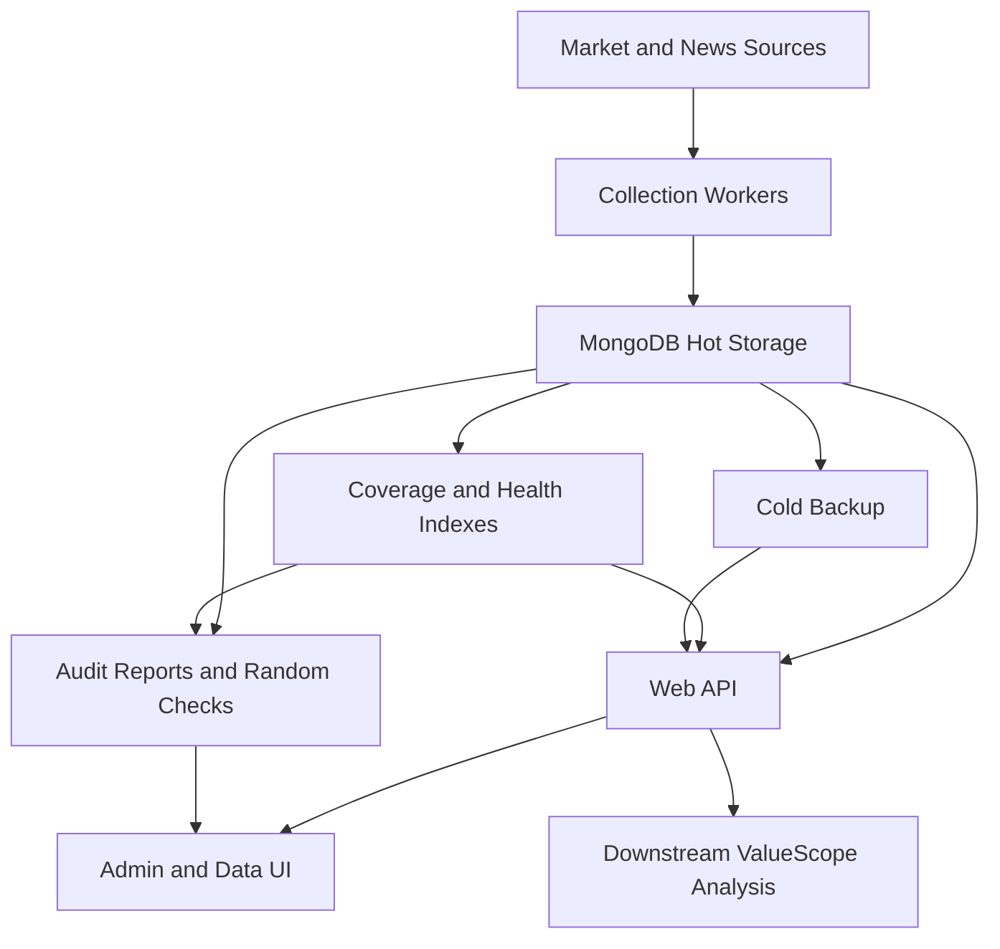

# Architecture

ValueScope DataHub is organized as a data collection, governance, and display platform with clear ownership boundaries between acquisition, storage, quality control, operations, presentation, and downstream ValueScope analysis.

## System Layers

## Design Goals

- Keep frequently accessed daily data hot in MongoDB.
- Move heavy historical minute data into cold storage while preserving fast per-stock retrieval.
- Track coverage and gaps so interrupted crawls can be resumed without guessing.
- Make long-running jobs visible in the UI, including progress, status, resource level, and latest event.
- Separate portfolio visibility from production implementation.

## Ownership Boundaries

| Area | Responsibility |
| --- | --- |
| NewsCrawler | Collect and normalize news into a stable news document contract. |
| Stock pipeline | Maintain stock metadata, daily rows, minute coverage, and cold backup references. |
| Web API | Serve stock, news, governance, account, and audit views. |
| Admin UI | Present operational status and allow controlled actions for the owner. |
| Cold backup | Store low-frequency historical objects outside the hot database. |
| ValueScope analysis | Consume curated DataHub datasets; it is not the primary responsibility of this public package. |

## Production Code Visibility

The public portfolio package intentionally describes architecture at a high level. It does not include implementation details that would allow a third party to reproduce the crawler, storage, or deployment system.
